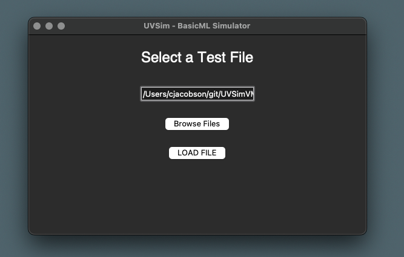

# Abacus - UVSim Virtual Machine - BasicML Simulator GUI

UVSim Virtual Machine GUI Implementation


## Description
This project on the `feature/gui` branch, enhances the UVSim virtual machine simulator by adding a graphical user interface (GUI) using Tkinter The GUI allows users to easily load, execute, and debug BasicML programs.

## GUI Features
1. **Title Frame**:
   - Welcome screen with START and HELP buttons.

2. **File Selection Frame**:
   - Allows users to browse and select a test file to load.

3. **Main Control Frame**:
   - Displays control buttons, memory display, current instruction, output panel, and user input panel.

4. **Help / Instructions Frame**:
   - Displays a helpful screen with instructions and further clarification about how to run the program.

5. **Color Customization Frame**:
   - Allows users to customize the primary and off colors of the interface.
   - Provides an option to reset colors to the default system preferences (background color: #275D38, font color: #FFFFFF).


## Installation

### Prerequisites
- `Python 3.x`
- `Tkinter` (usually included with Python, but installation instructions are provided below if needed)

### Tkinter Installation Instructions

#### Debian-based systems (e.g., Ubuntu):

```sh
sudo apt-get install python3-tk
```

#### MacOS:
Step 1. Make sure you are using the most up-to-date version(s) of python3 and pip3 to verify this run the following commands:

```
python3 --version
pip3 --version
```

Step 2: Upgrade your pip to avoid any errors during installation:

```
pip3 install --upgrade pip
```

Step 3: Enter the following command to install Tkinter using pip3:

```
pip3 install tk
```
#### Windows:
Tkinter is included with the standard Python installation. No additional installation is required.

## Clone the Repository

Step 1: Checkout the branch:
```
git checkout -b feature/gui
```

Step 2: Clone the repository:

```
git clone https://github.com/alex0112/abacus/tree/feature/gui
cd abacus
```
## Running the Program

The most basic invocation of the program is:

```
python3 gui.py
```
It expects a text file written in BasicML as an input to execute instructions. 
For further help on how to operate the GUI, click on HELP button on the bottom right of the window.

Check out the GUI Design Document here for further clarification: [Lucidchart Document](https://lucid.app/lucidchart/b264f5ba-3940-4e0d-82eb-cbf5a60dc4c8/edit?beaconFlowId=849C5C87E8B614FA&invitationId=inv_2d225cf5-c67a-4421-bf40-98fd634af577&page=0_0#).

### Title Frame
Once you have navigated to the `abacus` directory and entered the command above, you should be able to compile the interface that displays the title frame:


From the title frame, you can select `Start` or `Help`. The Start button will take you to the file selection frame.

### File Selection Frame
The file selection frame presents a message to the user: "Select a Test File." It also includes the `Browse Files` and `Load File` button(s):


To load a file, select the `Browse Files` button. You will then be presented with the option to select a test file from the `bml_examples\` folder as shown below:


Once you have selected your file, open it and click the `Load File` button:




### Main Control Frame
After selecting the `Load File` button, you will be presented with the Main Control Frame:


In future updates of this branch, the proposed framework of the Main Control Frame will look as follows:


Proposed concept for Main Control framework:
1. **Program Control Panel**:

      Function:  Controls for managing the simulation.

      Annotations:
      - Start Simulation Button: Begins the simulation of the loaded program.
      - Step Execution Button: Executes the program one instruction at a time for debugging.
      - Halt Button: Stops the execution of the current program.
      - Help Button: Opens the Help and Instructions Frame.
      - Select Test File Button: Returns to the File Selection Screen to choose a different file.

2. **Memory Display**:

      Function: Displays the current state of the UVSim memory.

      Description: Shows the contents of memory addresses (e.g., 00: +0000).

3. **Accumulator Display**:
      Function: Displays the value used for arithmetic and data manipulation.

      Description: Shows the current value in the accumulator register.

4. **Current Instruction Display**:
      Function: Displays the instruction currently being processed by the CPU.

      Description: Shows the current instruction being executed (e.g., +1007).

5. **Control Panel Display**:
      Function: Shows the output of the program.

      Description: Shows the current instruction being executed (e.g., +1007).

6. **User Input Panel**:
      Function: Allows user to enter data when prompted by the program. Allows inputing by pressing Enter.

      Description: Input field for user inputs (e.g., for READ instructions).


***NOTE: The Main Control Frame is currently only a framework!** It includes all the functionality discussed in the GUI Design Document. Scott and Jackson discussed after the meeting on 06/17 and agreed that Jackson would work on the initial framework of the GUI frames, and Scott would be responsible for implementing the Main Control Frame.*

### Help / Instructions Frame
The Help / Instructions frame provides guidance on how to use the application. You can access this page through two different buttons:


1. **From the Title Frame**: Click the `Help` button on the title frame to navigate directly to the Help / Instructions page. This is the first point of access if you need guidance before starting any operations within the application.

2. **From the Main Control Frame**: Once you have loaded a file and are in the Main Control Frame, you can access the Help / Instructions page by clicking the `Help` button located within this frame. This allows you to refer to the instructions at any point during your workflow.

The Help / Instructions page covers the following topics:
- Getting Started: Step-by-step instructions on how to begin using the application.
- File Selection: Guidance on how to browse and load files from the bml_examples\ folder.
- Main Control Functions: Detailed explanations of the functionalities available within the Main Control Frame
- Troubleshooting: Common issues and their solutions to ensure a smooth user experience.

### GUI Color Customization 


#### Accessing the Color Customization Frame
From the Title Frame, click on the `Color Selection` button to open the Color Customization frame.

#### Change Colors Button


1. In the Color Customization frame, click on the `Change Colors` button.
2. Select your preferred Primary and Off colors using the color chooser dialogs.
3. The application will restart with the new colors applied:

      


#### Reset Colors Button
1. In the Color Customization frame, click on the `Reset Colors` button.
2. The colors will revert to the default system preferences (background color: #275D38, font color: #FFFFFF).
3. The application will restart with the default colors.

      
