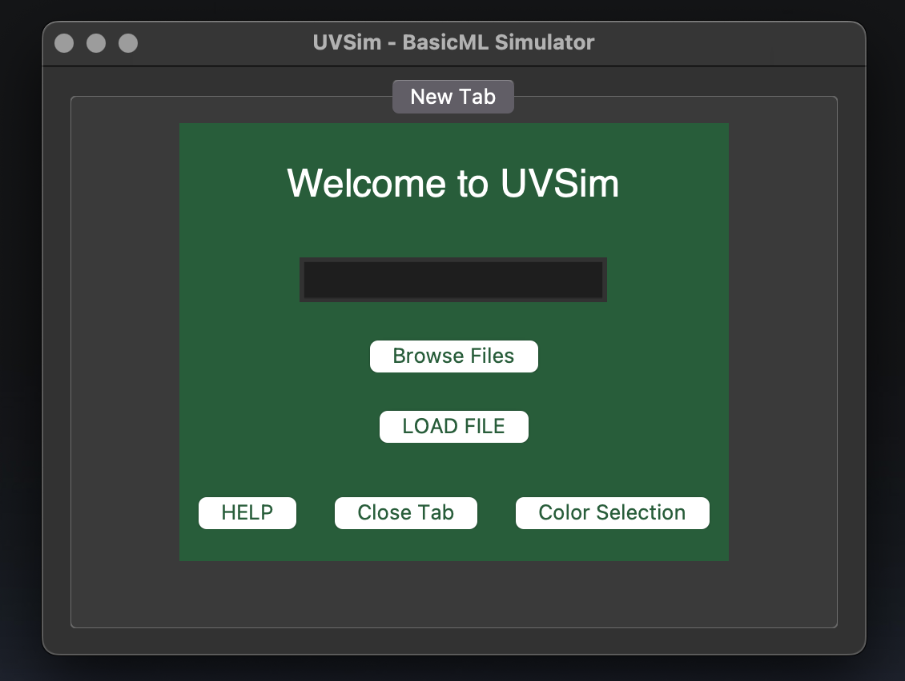
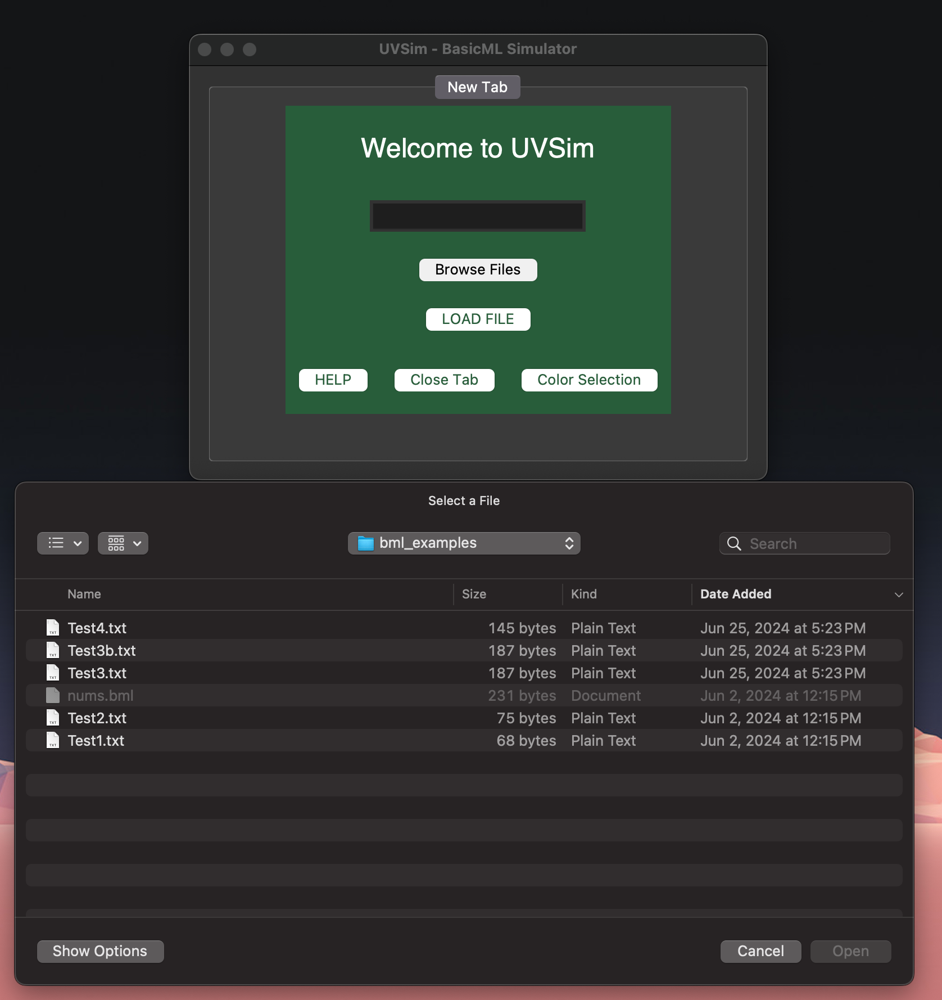
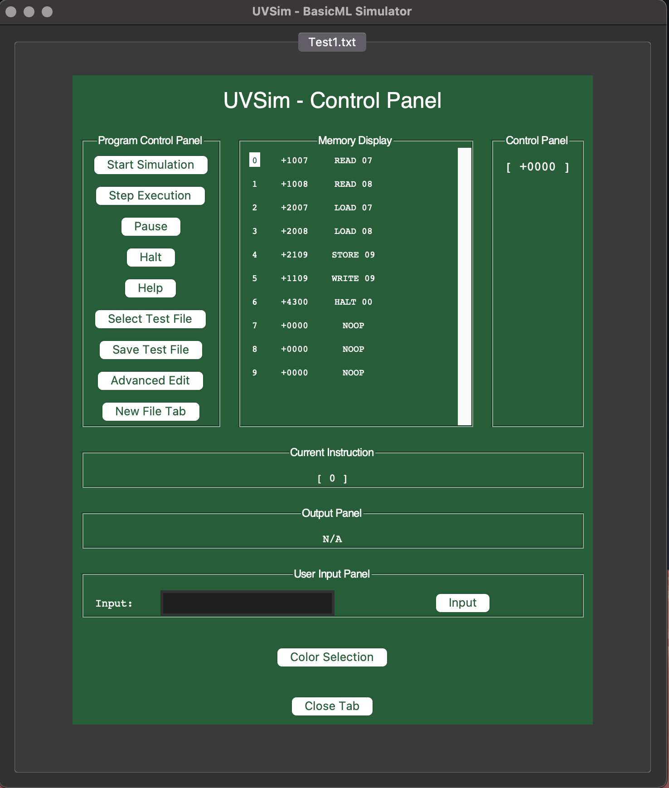
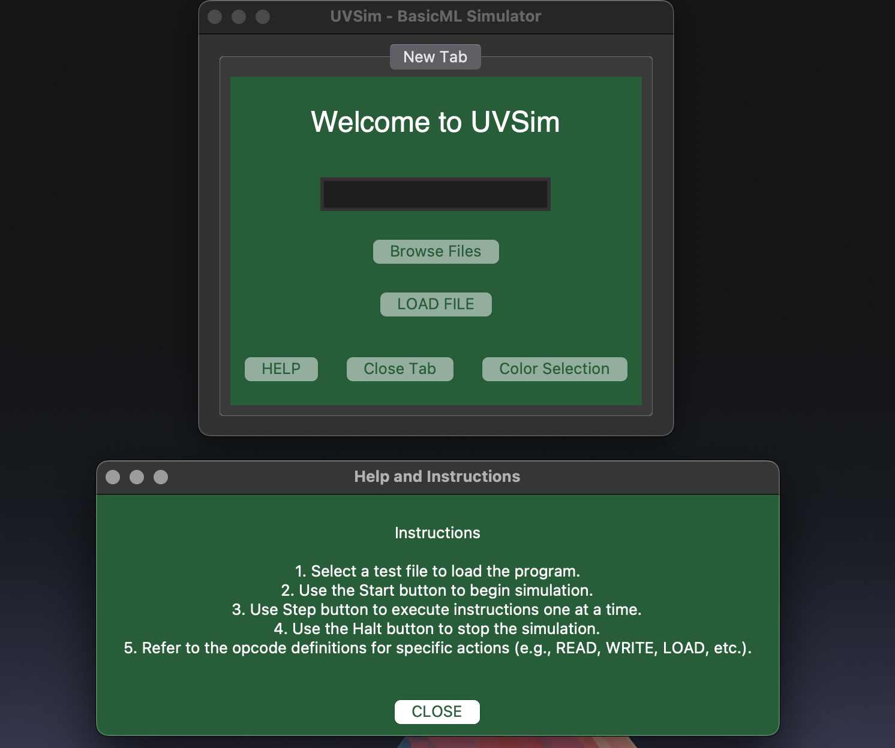

# Abacus - UVSim Virtual Machine - BasicML Simulator GUI

UVSim Virtual Machine GUI Implementation



## Description
This project, now merged into the `main` branch, enhances the UVSim virtual machine simulator by adding a comprehensive graphical user interface (GUI) using Tkinter. The GUI allows users to easily load, execute, and debug BasicML programs. The recent updates include several new features and improvements contributed by our team:

- **Enhanced user interface with a new tab management system** for handling multiple instances.
- **Advanced memory editing capabilities**, allowing direct modifications during runtime.
- **Improved program control panel** with additional functionality like save and load options for test files.

## GUI Features

1. **Title Frame**:
   - Welcome screen with START, HELP, and COLOR SELECTION buttons.

2. **File Selection Frame**:
   - Allows users to browse and select a test file to load.

3. **Main Control Frame**:
   - Displays control buttons, memory display, current instruction, output panel, and user input panel.
   - Features buttons for Start Simulation, Step Execution, Pause, Halt, Help, Select Test File, Save Test File, Advanced Edit, and New File Tab.

4. **Help / Instructions Frame**:
   - Displays a helpful screen with instructions and further clarification about how to run the program.

5. **Color Customization Frame**:
   - Allows users to customize the primary and off colors of the interface.
   - Provides an option to reset colors to the default system preferences (background color: #275D38, font color: #FFFFFF).

6. **Memory Edit Feature**:
   - Users can edit memory directly via the GUI, allowing changes to program data during runtime.

7. **GUI Tab Management**:
   - Multiple tabs can be opened for different UVSim instances, each running independently.

## Installation

### Prerequisites
- `Python 3.x`
- `Tkinter` (usually included with Python, but installation instructions are provided below if needed)

### Tkinter Installation Instructions

#### Debian-based systems (e.g., Ubuntu):

Install Tkinter using the package manager.

#### MacOS:
Ensure you have the most up-to-date versions of Python 3 and pip3, then upgrade pip and install Tkinter.

#### Windows:
Tkinter is included with the standard Python installation. No additional installation is required.

## Clone the Repository

Step 1: Checkout the branch:
```
git checkout -b main
```

Step 2:
```
git clone https://github.com/alex0112/abacus/tree/feature/gui
cd abacus
```

## Running the Program

The most basic invocation of the program is to run `gui.py`. It expects a text file written in BasicML as an input to execute instructions. For further help on how to operate the GUI, click the HELP button on the bottom right of the window.

The most basic invocation of the program is:
```
python3 gui.py
```

Check out the GUI Design Document here for further clarification: [Lucidchart Document](https://lucid.app/lucidchart/b264f5ba-3940-4e0d-82eb-cbf5a60dc4c8/edit?beaconFlowId=849C5C87E8B614FA&invitationId=inv_2d225cf5-c67a-4421-bf40-98fd634af577&page=0_0#).

### Title Frame
Once you have navigated to the `abacus` directory and entered the command above, you should be able to compile the interface that displays the title frame:


From the title frame, you can select `Start`, `Help`, or `Color Selection`. The Start button will take you to the file selection frame.

### File Selection Frame
The file selection frame presents a message to the user: "Select a Test File." It includes the `Browse Files` and `Load File` buttons.

To load a file, select the `Browse Files` button. You will then be presented with the option to select a test file from the `bml_examples\` folder:



Once you have selected your file, open it and click the `Load File` button:

### Main Control Frame
After selecting the `Load File` button, you will be presented with the Main Control Frame:



Proposed concept for Main Control framework:
1. **Program Control Panel**:
   - **Start Simulation Button**: Begins the simulation of the loaded program.
   - **Step Execution Button**: Executes the program one instruction at a time for debugging.
   - **Pause Button**: Pauses the current execution.
   - **Halt Button**: Stops the execution of the current program.
   - **Help Button**: Opens the Help and Instructions Frame.
   - **Select Test File Button**: Returns to the File Selection Screen to choose a different file.
   - **Save Test File Button**: Saves the current state of memory to a file.
   - **Advanced Edit Button**: Opens the advanced memory edit mode.
   - **New File Tab Button**: Opens a new tab for another UVSim instance.

2. **Memory Display**:
   - Displays the current state of the UVSim memory, allowing editing and previewing.

3. **Accumulator Display**:
   - Displays the value used for arithmetic and data manipulation.

4. **Current Instruction Display**:
   - Displays the instruction currently being processed by the CPU.

5. **Output Panel**:
   - Shows the output of the program and any error messages.

6. **User Input Panel**:
   - Allows user to enter data when prompted by the program.

### Help / Instructions Frame
The Help / Instructions frame provides guidance on how to use the application. You can access this page through two different buttons:



1. **From the Title Frame**: Click the `Help` button on the title frame to navigate directly to the Help / Instructions page. This is the first point of access if you need guidance before starting any operations within the application.

2. **From the Main Control Frame**: Once you have loaded a file and are in the Main Control Frame, you can access the Help / Instructions page by clicking the `Help` button located within this frame. This allows you to refer to the instructions at any point during your workflow.

The Help / Instructions page covers the following topics:
- Getting Started: Step-by-step instructions on how to begin using the application.
- File Selection: Guidance on how to browse and load files from the bml_examples\ folder.
- Main Control Functions: Detailed explanations of the functionalities available within the Main Control Frame.
- Troubleshooting: Common issues and their solutions to ensure a smooth user experience.

### GUI Color Customization 


#### Accessing the Color Customization Frame
From the Title Frame, click on the `Color Selection` button to open the Color Customization frame.

#### Change Colors Button


1. In the Color Customization frame, click on the `Change Colors` button.
2. Select your preferred Primary and Off colors using the color chooser dialogs.
3. The application will restart with the new colors applied:

   

#### Reset Colors Button
1. In the Color Customization frame, click on the `Reset Colors` button.
2. The colors will revert to the default system preferences (background color: #275D38, font color: #FFFFFF).
3. The application will restart with the default colors.

   